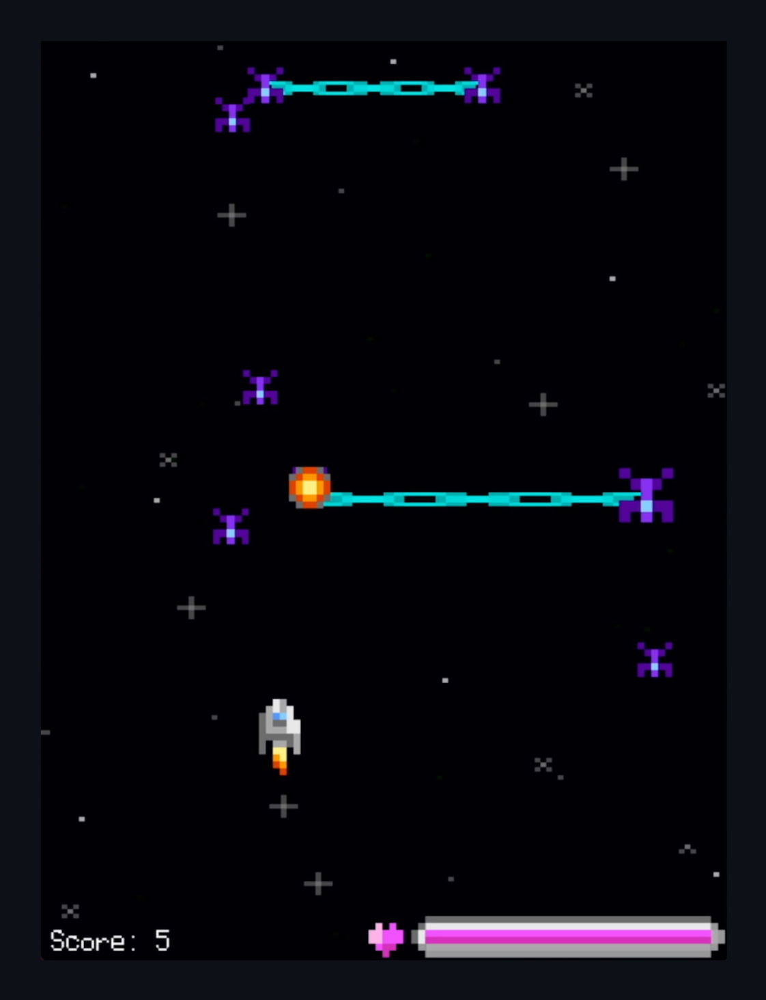
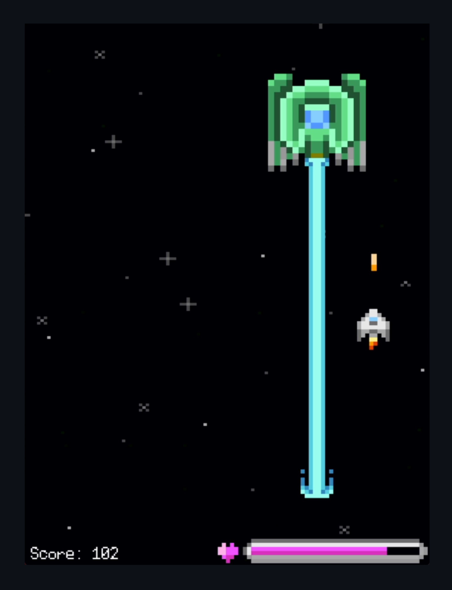

## Table of Contents

- [About](#about)
- [Features](#features)
- [Screenshots](#screenshots)
- [Gameplay](#gameplay)
- [Getting Started](#getting-started)
- [License](#license)

## About

QuantumShooter is an exciting space shooter game with a quantum twist. Pilot your spaceship through the depths of space, battling against waves of alien enemies and harnessing the power of quantum technology to gain the upper hand. Your mission: defend the universe from impending doom!

## Features

- 🚀 Fast-paced space shooter gameplay.
- ⚛️ Quantum power-ups and abilities.
- 👾 Quantum entangled enemies.
- 🏆 Challenging boss battles.
- 🎮 Pixel art graphics and retro sound effects.

## Screenshots






## Gameplay

Watch the gameplay at [QuantumShooter Demo](https://yourusername.github.io/QuantumShooter).

## Getting Started

Follow these steps to get QuantumShooter up and running on your local machine:

1. Clone this repository:

   ```bash
   git clone https://github.com/YourUsername/QuantumShooter.git

2. Open the project directory:

   ```bash
   cd QuantumShooter

3. Create a Conda environment based on the provided environment configuration:

   ```bash
   conda env create -f ./environment.yaml

4. Activate the Conda environment:

   ```bash
   conda activate QuantumShooter

5. Now, you're ready to run QuantumShooter! Launch the game using Python:

   ```bash
   python game.py

## License

This project is licensed under the MIT License - see the [License](LICENSE) file for details.
